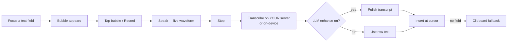
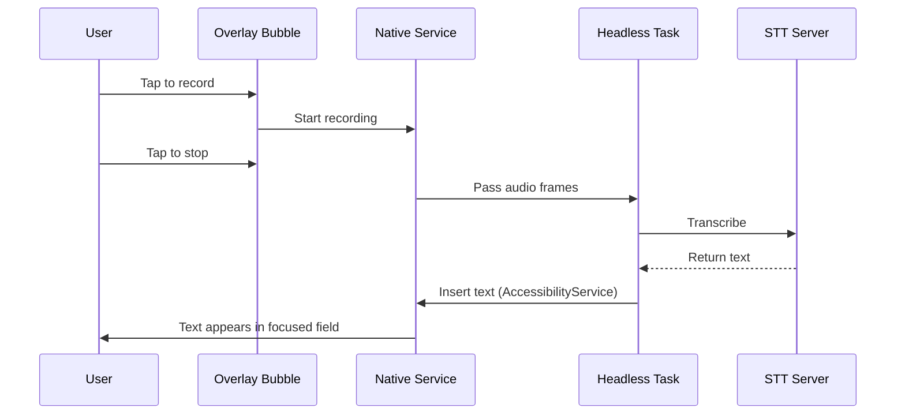
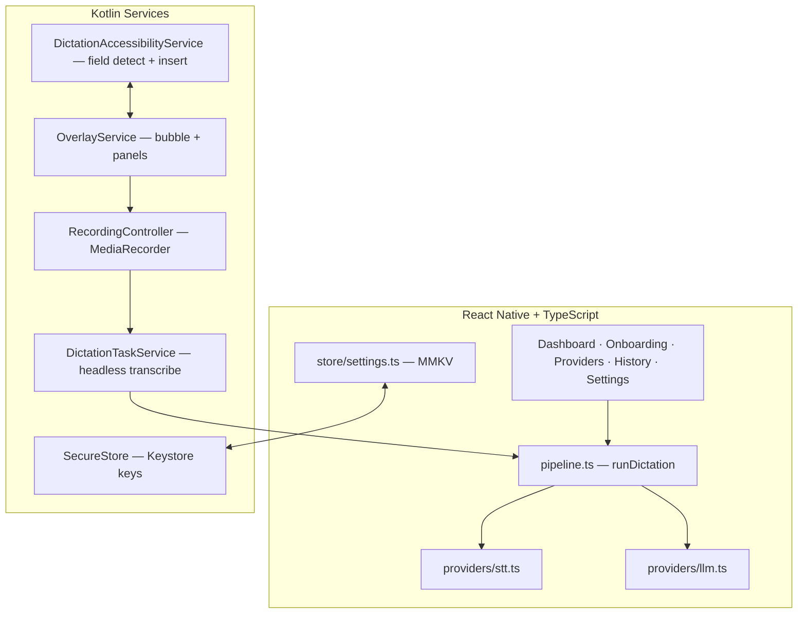

<div align="center">

# OpenType

### Stop typing. Start speaking.

**Open-source, bring-your-own-model voice dictation for Android.**

Any OpenAI-compatible transcription server — or fully offline on-device Whisper.
No vendor cloud. No account. Your voice never leaves the servers *you* choose.

[](LICENSE)
[](https://github.com/)
[](https://reactnative.dev/)
[](https://react.dev/)
[](https://www.typescriptlang.org/)
[](CONTRIBUTING.md)
[](#)

[Features](#-features) · [How It Works](#-how-it-works) · [Quick Start](#-quick-start) · [BYOM](#-bring-your-own-model) · [Self-Hosting](#-self-hosting-one-command) · [Architecture](#-architecture) · [Configuration](#-configuration-reference) · [Troubleshooting](#-troubleshooting) · [Contributing](#-contributing)

</div>

---

## What is OpenType?

OpenType is a voice dictation app for Android built with React Native 0.87, React 19, and TypeScript 6. It transcribes speech via cloud APIs (OpenAI, Groq, self-hosted) or fully on-device (whisper.cpp), optionally polishes transcripts with an LLM, and auto-inserts text into the focused field of any app via an Accessibility Service. The app has no analytics, no vendor cloud dependency, and no accounts — your voice data stays on servers you control or never leaves the phone at all.

---

## Features

### Floating Bubble — Dictate in Any App

A calm, springy bubble floats over other apps and appears automatically whenever you focus a text field.

- **Tap to record** in place — the bubble expands into a dark recording chamber with a live 7-bar waveform, timer, and Stop/Discard controls
- **Drag anywhere** — it pops, squashes, and settles with physics-based motion
- **Customizable** in Settings → Bubble: master switch, size (70/85/100/115%), opacity (40–100%)
- **10-minute auto-stop** safety cap — long recordings transcribe what was captured instead of losing it
- **Crash recovery** — interrupted recordings are detected on relaunch with Transcribe/Discard options

### Auto-Paste Where Your Cursor Is

An Accessibility service finds the focused text field and inserts your words.

- **Direct set-text** insertion via AccessibilityService
- **Clipboard + paste fallback** when no field can take the text
- **No screen reading** — used exclusively for field detection and insertion
- **Password fields excluded** for security

### Bring Your Own STT (Cloud, Self-Hosted, or On-Device)

| Provider | Base URL | Model | Key Required |
|----------|----------|-------|:------------:|
| OpenAI | `https://api.openai.com/v1` | `whisper-1` | Yes |
| Groq | `https://api.groq.com/openai/v1` | `whisper-large-v3-turbo` | Yes |
| Self-hosted faster-whisper | `http://<host>:9000/v1` | `whisper-1` | Usually no |
| Custom | Any OpenAI-compatible endpoint | Your model ID | Depends |

**Live verification**: Test connection loads the real model list from *your* server. Servers without a `/v1/models` endpoint fall back to manual model entry + a 3-second live transcription test ("Heard: ...").

**Fully offline mode**: Download whisper.cpp models once — the finished download auto-selects itself and unlocks Continue immediately. Audio never leaves the phone.

### Optional LLM Polish

- Any OpenAI-compatible `/v1/chat/completions` server (OpenAI, Groq, LiteLLM, Ollama gateways)
- Custom system prompt (ships with a dictation-cleanup default)
- Per-dictation Enhance toggle, "enhance by default" setting
- **Graceful degradation**: If the LLM is unreachable, the transcript is still delivered and honestly labeled `raw · LLM skipped` — never silently dropped

### Dashboard Home

- One-tap record button with breathing idle, ember recording, and working states
- Live stats: dictations, words, insert-success rate
- Bubble permission status with one-tap fixes
- 3 most recent dictations at a glance

### 5-Step Guided Onboarding

1. **Welcome** — what the app does, in three lines
2. **Permissions checklist** — microphone, bubble overlay, auto-paste on one screen, each with "why it matters" before the system dialog fires
3. **Battery** — skippable exemption step (per-OEM guidance) so aggressive ROMs don't kill recordings
4. **Voice setup** — STT + optional LLM, each ending in an explicit verified state
5. **Ready** — summary of your configuration, then straight to dictating

### On-Device History

- Last 100 dictations with timestamp, duration, polished/raw state, and inserted/clipboard outcome
- Copy, delete, animated Clear-all with explicit count + toast confirmation
- Headless-task entries (recorded from the bubble while the app UI was dead) merge in automatically on next foreground

### Calm Flow Design System

- **Two themes**: warm-paper (light) + ink-chamber (dark), follows system setting
- **49 semantic color tokens** per theme — no hardcoded colors in screens
- **Research-backed motion ladder**: 120ms press → 200ms fades → 320ms transitions
- **Spring physics**: `orbSnap` (damping 15, stiffness 180), `spring` (22, 190), `gentleSpring` (26, 140)
- **38 inline SVG icons** via `AppIcon` — zero native linking, dev-only glyph audit screen
- **~50 reusable UI components** in `src/ui.tsx`

---

## How It Works



1. Grant mic, overlay, and Accessibility permissions (guided once during onboarding)
2. Tap **Record** in-app, or tap the **bubble** in any app
3. Stop recording
4. Transcribe via your configured server or on-device whisper.cpp
5. Optionally polish the transcript with an LLM
6. Auto-insert into the focused field, or clipboard fallback when no field is detected

### Headless Task (Overlay Bubble)

When you tap the bubble while the app UI is closed, a **headless JS task** runs the full dictation pipeline without opening the app. Results are stored and merged into your history on next foreground.



---

## Quick Start

### Prerequisites

| Tool | Version | Purpose |
|------|---------|---------|
| Node.js | >= 22.11 | Runtime and package manager |
| JDK | 17 | Android build toolchain |
| Android SDK | API 34+ | Target platform |
| Device/Emulator | Android 8+ | Testing target |

### Install and Run

```sh
# Clone the repository
git clone https://github.com/<your-username>/open-type.git
cd open-type

# Install dependencies
npm install

# Start Metro bundler (keep running in a separate terminal)
npm start

# Build and install on connected device
npm run android
```

### Metro Cache Reset

After changing `babel.config.js` or any animation library, always restart Metro with cache reset:

```sh
npm start -- --reset-cache
```

### Verify Before Pushing

All three commands must pass with zero errors:

```sh
npm run typecheck    # tsc --noEmit
npm test             # jest — 41 tests
npm run lint         # eslint, 0 errors
```

### Manual APK Install

```sh
cd android && ./gradlew :app:assembleDebug
adb reverse tcp:8081 tcp:8081
adb install -r app/build/outputs/apk/debug/app-debug.apk
adb shell am start -n com.opentype.app/.MainActivity
```

---

## Bring Your Own Model

### Speech-to-Text Providers

| Provider | Base URL | Model | Key | Notes |
|----------|----------|-------|:---:|-------|
| **OpenAI** | `https://api.openai.com/v1` | `whisper-1` | Yes | Default preset. Supports live streaming via Realtime API. |
| **Groq** | `https://api.groq.com/openai/v1` | `whisper-large-v3-turbo` | Yes | Fast inference. OpenAI-compatible endpoint. |
| **Self-hosted** | `http://<host>:9000/v1` | `whisper-1` | Usually no | faster-whisper via Docker. See [Self-Hosting](#-self-hosting-one-command). |
| **Custom** | Any URL | Your model | Depends | Any OpenAI-compatible `/v1/audio/transcriptions` endpoint. |

### Live Streaming Providers

| Provider | Protocol | Auth | Default Model | Notes |
|----------|----------|------|---------------|-------|
| **OpenAI Realtime** | `wss://api.openai.com/v1/realtime` | Bearer token | `gpt-4o-transcribe` | Resamples 16kHz → 24kHz automatically |
| **Deepgram** | `wss://api.deepgram.com/v1/listen` | Token header | `nova-3` | Raw PCM16 send, fast cold start |
| **WhisperLive** | `ws://<host>:9090` | Optional | Custom | Open-source, self-hosted WebSocket server |

Live streaming configuration is separate from upload configuration. Each has its own model, language, and server URL settings.

### LLM Enhancement

Any OpenAI-compatible `/v1/chat/completions` endpoint works:

| Provider | Base URL | Notes |
|----------|----------|-------|
| OpenAI | `https://api.openai.com/v1` | GPT-4o, GPT-4o-mini, etc. |
| Groq | `https://api.groq.com/openai/v1` | Fast, low-cost |
| LiteLLM | `http://<host>:4000/v1` | Proxy to any LLM |
| Ollama | `http://localhost:11434/v1` | Local models via OpenAI wrapper |

Custom system prompt ships with a dictation-cleanup default. Edit in Settings → LLM.

### On-Device Models (whisper.cpp)

| Model ID | Language | Size | Speed | Accuracy | Use Case |
|----------|----------|------|-------|----------|----------|
| `tiny.en` | English | 75 MB | Fastest | Good | Quick notes, low-end devices |
| `base.en` | English | 142 MB | Fast | Better | Daily dictation (recommended) |
| `tiny` | Multilingual | 75 MB | Fastest | Good | Non-English, low-end devices |
| `base` | Multilingual | 142 MB | Fast | Better | Non-English daily use |
| `small.en` | English | 466 MB | Slower | Best | High-accuracy transcription |

Models download from HuggingFace with multi-mirror fallback (HuggingFace + hf-mirror.com), resume on interruption, and integrity verification (95% of expected bytes required).

---

## Self-Hosting (One Command)

Ship your own transcription cloud with faster-whisper:

```sh
cd self-host
docker compose up -d
```

This starts two services:

| Service | Port | Protocol | Purpose |
|---------|------|----------|---------|
| `whisper` | 9000 | HTTP | OpenAI-compatible `POST /v1/audio/transcriptions` |
| `whisper-live` | 9090 | WebSocket | Live streaming transcription |

Then in the app, pick the **Self-hosted** preset and point it at `http://<host>:9000/v1`.

### Docker Compose Configuration

```yaml
services:
  whisper:
    image: ghcr.io/hwdsl2/docker-whisper:latest
    ports:
      - "9000:9000"
    environment:
      WHISPER_MODEL: base
      WHISPER_LANGUAGE: auto
    restart: unless-stopped

  whisper-live:
    image: ghcr.io/collabora/whisperlive-cpu:latest
    ports:
      - "9090:9090"
    command: ["python3", "run_server.py", "--port", "9090", "--backend", "faster_whisper"]
    restart: unless-stopped
```

### Network Notes

- For LAN access, use your machine's IP address (e.g., `192.168.1.100`)
- Find your IP: `ifconfig | grep "inet " | grep -v 127.0.0.1`
- Ensure firewall allows traffic on ports 9000 and 9090
- WhisperLive needs a GPU for comfort; CPU works for `tiny`/`base` models

---

## Architecture



### Module Reference

| Area | Key Files | Description |
|------|-----------|-------------|
| App shell | `App.tsx` | Root component, 4-tab shell, error boundary, recovery |
| Design system | `src/theme.ts`, `src/ui.tsx` | 49 color tokens, ~50 UI primitives |
| Icons | `src/icons.tsx` | 38 inline SVG icons (zero native linking) |
| Voice orb | `src/Orb.tsx` | Animated recording bubble with 6 visual states |
| Onboarding | `src/onboarding/OnboardingWizard.tsx` | 5-step guided setup |
| STT provider | `src/SttEditor.tsx`, `src/providers/stt.ts` | Cloud + on-device transcription |
| LLM provider | `src/LlmEditor.tsx`, `src/providers/llm.ts` | Transcript enhancement |
| Live streaming | `src/LiveEditor.tsx`, `src/stream/` | WebSocket drivers (Deepgram, OpenAI, WhisperLive) |
| Pipeline | `src/services/pipeline.ts` | Transcribe → enhance sequence with graceful degradation |
| Model management | `src/providers/models.ts` | whisper.cpp catalog, download with resume + mirrors |
| Storage | `src/store/settings.ts` | MMKV-backed settings + history CRUD |
| Native bridge | `src/native/modules.ts` | 30+ native functions (permissions, recording, a11y, storage) |
| Headless task | `src/tasks/dictationTask.ts` | Overlay bubble dictation without app UI |
| Logging | `src/logging.ts` | In-memory ring buffer with pub/sub |
| Haptics | `src/haptics.ts` | 6 vibration patterns for feedback |
| HTTP | `src/net.ts` | Timeout, retry, cancellation, URL normalization |
| Widgets | `src/widgets.tsx` | Confetti, charts, badges, copy button |

### Entry Points

| Entry | Registration | Purpose |
|-------|-------------|---------|
| Main App | `AppRegistry.registerComponent('OpenType', () => App)` | 4-tab UI |
| Headless Task | `AppRegistry.registerHeadlessTask('DictationTask', () => task)` | Overlay bubble dictation |

---

## Design System

### Calm Flow

OpenType uses a custom design system called **Calm Flow** with warm, paper-like aesthetics.

**Light Theme (warm-paper)**: Soft cream backgrounds, lavender CTA, forest/ember status colors
**Dark Theme (ink-chamber)**: Deep charcoal, muted surfaces, coral accents

### Color Tokens

49 semantic tokens per theme — no hardcoded colors allowed in screen components:

| Token | Light | Dark | Usage |
|-------|-------|------|-------|
| `bg` | Cream | Charcoal | Screen background |
| `surface` | White | Dark gray | Card background |
| `ink` | Near-black | Off-white | Primary text |
| `inkMid` | Gray | Light gray | Secondary text |
| `coral` | Warm red | Light coral | Primary accent, record button |
| `amber` | Gold | Light amber | LLM enhancing state |
| `done` | Green | Light green | Success state |
| `err` | Red | Light red | Error state |
| `line` | Light gray | Dark gray | Borders, dividers |

### Motion

Research-backed motion ladder for consistent feel:

| Duration | Use |
|----------|-----|
| 120ms | Press scale (`0.97` → spring back) |
| 200ms | Fade in/out |
| 320ms | Page transitions, layout changes |

Spring physics constants:
- `orbSnap`: damping 15, stiffness 180 (recording orb)
- `spring`: damping 22, stiffness 190 (general purpose)
- `gentleSpring`: damping 26, stiffness 140 (subtle motion)

### Haptic Feedback

6 distinct vibration patterns (Android only, iOS silently skips):

| Trigger | Pattern | Use |
|---------|---------|-----|
| `record-start` | Short pulse | Begin recording |
| `record-stop` | Double pulse | End recording |
| `insert-ok` | Success pattern | Text inserted successfully |
| `insert-fail` | Error pattern | Insertion failed |
| `perm-denied` | Warning pattern | Permission denied |
| `download-done` | Completion pattern | Model download complete |

---

## Android Permissions

| Permission | Why | When Required |
|------------|-----|---------------|
| `RECORD_AUDIO` | Capture dictation audio | First recording |
| `SYSTEM_ALERT_WINDOW` | Floating bubble over other apps | Bubble mode |
| `BIND_ACCESSIBILITY_SERVICE` | Detect focused text field and insert text | Auto-paste |
| `FOREGROUND_SERVICE` (+ microphone type) | Keep recording/bubble alive | Always (when active) |
| `POST_NOTIFICATIONS` | Foreground-service status (Android 13+) | Android 13+ |

**Accessibility access scope**: Used *only* to find the focused editable field and insert text. No screen reading, no scraping, no data collection.

---

## Privacy & Security

### Data Flow

```
Audio → [Your Server OR On-Device] → Text → [Optional LLM] → Focused Field
                                                                   ↓
                                                            Clipboard (fallback)
```

- **No vendor cloud**: There is nowhere for your data to go except servers you type in
- **No account**: No sign-up, no email, no tracking
- **No analytics**: Zero telemetry, zero crash reporting to third parties
- **On-device mode**: Audio never leaves the phone
- **History stays on device**: Max 100 entries, encrypted store

### Encryption

- API keys stored in **Android Keystore-backed encrypted MMKV**
- 256-bit encryption key held by the Keystore
- Keys never appear in logs (log export redacts secrets)
- Settings synced via encrypted native bridge

### Accessibility Scope

The AccessibilityService is used for exactly two things:

1. **Field detection**: Find the currently focused editable text field
2. **Text insertion**: Insert the transcribed text via `setText()`

No screen content is read, stored, or transmitted.

---

## Configuration Reference

### STT Settings

| Setting | Type | Default | Description |
|---------|------|---------|-------------|
| `stt.kind` | `'openai-compatible' \| 'on-device'` | `'openai-compatible'` | STT provider type |
| `stt.mode` | `'upload' \| 'live'` | `'upload'` | Upload finished audio or stream live |
| `stt.preset` | `'openai' \| 'groq' \| 'selfhost' \| 'custom'` | `'openai'` | One-tap server preset |
| `stt.baseUrl` | `string` | `'https://api.openai.com/v1'` | API base URL |
| `stt.apiKey` | `string` | `''` | API key (encrypted in Keystore) |
| `stt.model` | `string` | `'whisper-1'` | Model identifier |
| `stt.language` | `string` | `''` | BCP-47 code, empty = auto-detect |
| `stt.onDeviceModelId` | `string` | `'tiny.en'` | Downloaded whisper.cpp model |

### LLM Settings

| Setting | Type | Default | Description |
|---------|------|---------|-------------|
| `llm.enabled` | `boolean` | `false` | Enable LLM polish |
| `llm.preset` | `'openai' \| 'groq' \| 'custom'` | `'openai'` | LLM provider preset |
| `llm.baseUrl` | `string` | `'https://api.openai.com/v1'` | LLM base URL |
| `llm.apiKey` | `string` | `''` | LLM API key |
| `llm.model` | `string` | `''` | LLM model |
| `llm.systemPrompt` | `string` | *(cleanup prompt)* | How transcripts get polished |

### Bubble Settings

| Setting | Type | Default | Description |
|---------|------|---------|-------------|
| `bubbleSize` | `number` | `100` | Size percentage (70/85/100/115) |
| `bubbleOpacity` | `number` | `80` | Opacity percentage (40/60/80/100) |

### UI Settings

| Setting | Type | Default | Description |
|---------|------|---------|-------------|
| `themeMode` | `'system' \| 'light' \| 'dark'` | `'system'` | Theme override |
| `hapticsEnabled` | `boolean` | `true` | Vibration feedback |
| `enhanceByDefault` | `boolean` | `false` | Default per-dictation enhance |

### Onboarding

| Setting | Type | Default | Description |
|---------|------|---------|-------------|
| `onboarding.completed` | `boolean` | `false` | Onboarding done |
| `onboarding.step` | `number` | `0` | Resume step index |

### History

| Setting | Type | Default | Description |
|---------|------|---------|-------------|
| Max entries | `number` | `100` | Oldest trimmed on append |
| Storage key | `string` | `'opentype.history.v1'` | MMKV key |

---

## On-Device Models

### Download Process

1. **Probe mirrors** — HuggingFace primary, hf-mirror.com fallback
2. **Ranged resume** — downloads to `.part` file, resumes from last good byte
3. **Multi-mirror retry** — up to 8 attempts per mirror with exponential backoff (2s base, 10s max)
4. **Watchdog stall detection** — checks every 5s, aborts after 25s of no data
5. **Integrity gate** — file must be >= 95% of expected bytes before promotion
6. **Auto-select** — finished download auto-selects itself, unlocks Continue

### Model Selection

Models are cached in a `WhisperContext` with lazy initialization. The first transcription after selecting a model loads it into memory; subsequent transcriptions reuse the cached context.

---

## Live Streaming

### Provider Comparison

| Feature | OpenAI Realtime | Deepgram | WhisperLive |
|---------|----------------|----------|-------------|
| Protocol | WSS | WSS | WS |
| Auth | Bearer token | Token header | Optional |
| Audio format | Base64 JSON | Raw PCM16 | Raw int16 |
| Sample rate | 24kHz (resampled) | 16kHz | 16kHz |
| End-of-speech | Session control | `{type: "Finalize"}` | `END_OF_AUDIO` sentinel |
| Self-hostable | No | No | Yes |

### Fallback Behavior

When `fallbackToUpload` is enabled and the live connection fails mid-stream:

1. The retained WAV is uploaded via HTTP to the configured STT endpoint
2. The user sees a "Fell back to upload" message
3. The transcript is still delivered

### WebSocket Handshake

Each driver performs a specific handshake:

- **OpenAI Realtime**: Expects `session.created` or `session.updated` event
- **Deepgram**: Expects first `Results` message
- **WhisperLive**: Sends JSON config (`uid`, `language`, `task`, `model`, `use_vad`), expects `SERVER_READY`

---

## Troubleshooting

<details>
<summary><b>Red screen: Reanimated/Worklets version mismatch</b></summary>

Stale Metro cache serving a bundle transformed without the worklets babel plugin.

```sh
npm start -- --reset-cache
npm run android
```

Kill Metro, restart with cache reset, reinstall the APK.
</details>

<details>
<summary><b>Icons show as boxes / question marks</b></summary>

The icon font wasn't bundled. This repo wires `fonts.gradle` in `android/app/build.gradle` — run a clean build:

```sh
cd android && ./gradlew :app:assembleDebug
```

Check Settings → About → icon audit (dev builds).
</details>

<details>
<summary><b>Bubble doesn't appear</b></summary>

Check Home → Bubble status for:

1. **Overlay permission** — granted?
2. **Accessibility service** — enabled?
3. **Battery exemption** — Samsung/Xiaomi/Oppo need OEM-specific steps
4. **Text field focused** — password fields are intentionally excluded
</details>

<details>
<summary><b>Text lands on clipboard instead of the field</b></summary>

Expected fallback when no focused field accepts insertion. If it happens everywhere:

1. Re-enable the Accessibility service in Android Settings
2. Ensure the service is not battery-optimized
3. Restart the app after enabling
</details>

<details>
<summary><b>On-device model won't verify / Continue stays disabled</b></summary>

A finished download auto-selects itself. If stuck:

1. Tap **Use this model** on the downloaded row
2. Re-open the Models tab to re-verify
3. Check storage space (models need 2x space during download)
</details>

<details>
<summary><b>Connection test fails</b></summary>

1. Verify the base URL is correct (check for trailing `/v1`)
2. Ensure the API key is valid (401 = invalid key)
3. Check if the server is reachable from your device
4. For self-hosted: ensure Docker is running and ports are accessible
5. For Groq: verify you have whisper model access enabled
</details>

<details>
<summary><b>Recording interrupted / crash recovery</b></summary>

If the app crashes during recording:

1. Re-open the app — a recovery banner appears
2. Choose **Transcribe** to process the recovered audio
3. Choose **Discard** to delete the incomplete recording
4. The interrupted audio is stored in native pending state
</details>

<details>
<summary><b>History not syncing from overlay</b></summary>

Headless-task entries merge automatically on next foreground. If missing:

1. Open the app to trigger `drainPendingHistory()`
2. Check Settings → About → logs for merge errors
3. Ensure the native bridge is initialized (app may need restart)
</details>

---

## Comparison

| Feature | OpenType | Wispr Flow | MacWhisper | Apple Dictation |
|---------|:--------:|:----------:|:----------:|:---------------:|
| **Open source** | Yes | No | No | No |
| **BYOM (any provider)** | Yes | No | Yes | No |
| **On-device mode** | Yes (whisper.cpp) | No | Yes (WhisperX) | Yes |
| **Android** | Yes | No | No | Yes |
| **iOS** | Roadmap | Yes | Yes | Yes |
| **Cost** | Free + API costs | Subscription | One-time purchase | Free |
| **LLM polish** | Yes (any server) | No | No | No |
| **Floating bubble** | Yes | Yes | No | No |
| **Self-hostable** | Yes (Docker) | No | No | No |
| **No account needed** | Yes | No | Yes | Yes |

**Positioning**: OpenType combines Wispr Flow's interaction grammar (bubble → waveform → insert) with MacWhisper's BYOM flexibility, fully open-source and Android-first. No vendor server involved at all.

---

## Roadmap

### Completed

- [x] Floating bubble + Accessibility auto-paste + clipboard fallback
- [x] OpenAI-compatible STT (presets, live model list, manual fallback, 3s test)
- [x] On-device Whisper (download catalog, auto-select, offline transcribe)
- [x] LLM polish (any OpenAI-compatible server, custom prompt, graceful skip)
- [x] Dashboard, 5-step onboarding, history, Calm Flow themes
- [x] Live streaming (Deepgram, OpenAI Realtime, WhisperLive)
- [x] Crash recovery + interrupted recording detection
- [x] Headless dictation task (overlay bubble without app UI)
- [x] 41 tests passing

### Planned

- [ ] Personal dictionary / snippets / per-app styles
- [ ] Command mode ("delete that", "make it formal")
- [ ] iOS (keyboard/share extension — iOS cannot do system-wide bubbles)
- [ ] Widget + quick-tile record shortcuts
- [ ] Language chip expansion (more presets)
- [ ] History export to file
- [ ] RTL layout audit
- [ ] Per-OEM battery optimization guides

---

## Contributing

We welcome contributions! See [CONTRIBUTING.md](CONTRIBUTING.md) for the full guide.

### Quick Start

```sh
git clone https://github.com/<your-username>/open-type.git
cd open-type
git checkout -b feature/your-feature
npm install
npm start
```

### Code Style Rules

1. **No hardcoded colors** — use theme tokens from `src/theme.ts`
2. **Icons via `AppIcon` only** — never use icon fonts
3. **Async state pattern**: idle → working → ok / failed-with-retry
4. **Human-readable errors** — no stack traces in UI
5. **TypeScript strict** — no `any` unless absolutely necessary

### PR Checklist

- [ ] `npm run typecheck` passes
- [ ] `npm test` passes (41 tests)
- [ ] `npm run lint` passes (0 errors)
- [ ] Tested on a real Android device
- [ ] No hardcoded colors
- [ ] Error messages are user-friendly

### Good First Issues

- Dictionary UI — personal word list management
- Snippet expansion — custom text shortcuts
- Per-OEM battery guides — Samsung, Xiaomi, Oppo steps
- RTL audit — right-to-left language support
- History export — export dictations to file

---

## FAQ

**Is this a Wispr Flow clone?**

Inspired by its interaction grammar (bubble → waveform → insert), but fully independent, open-source, and BYOM — no vendor server involved at all.

**Does it work offline?**

Yes — download an on-device Whisper model once; transcription and history then work with zero network.

**Why Android only?**

System-wide floating bubbles + field insertion require overlay + accessibility APIs iOS doesn't offer. iOS would need a keyboard extension (on the roadmap).

**Where do I get help?**

Open an issue with: device model, Android version, provider config (URLs only, never keys), and a logcat snippet or exported debug log.

**How much does it cost?**

The app is free and open-source. You pay only for API usage (OpenAI, Groq, etc.) if you use cloud providers. On-device mode is completely free.

**Is my data safe?**

OpenType has no analytics, no accounts, and no vendor cloud. API keys are encrypted in Android Keystore. Your voice data goes only to servers you configure, or never leaves the phone in on-device mode.

---

## License

[MIT](LICENSE) — use it, fork it, ship it.

---

<div align="center">

Built in the open. Your voice, your models, your phone.

[Top](#opentype) · [Features](#-features) · [Quick Start](#-quick-start) · [Contributing](#-contributing)

</div>
